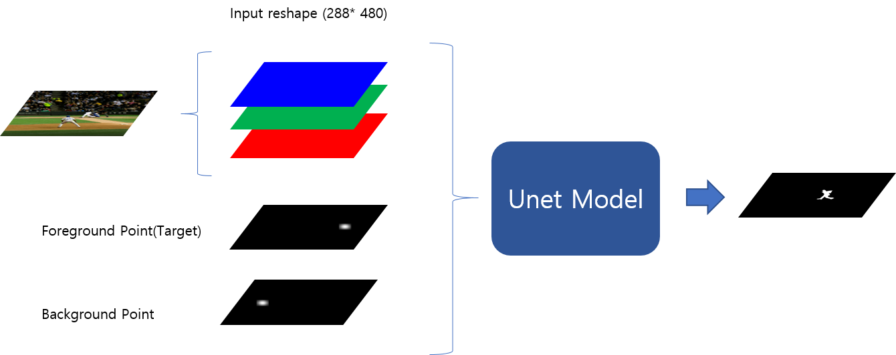
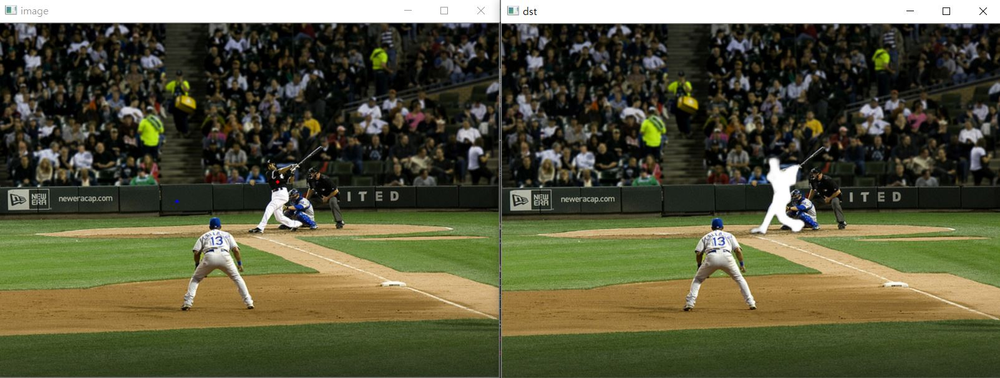
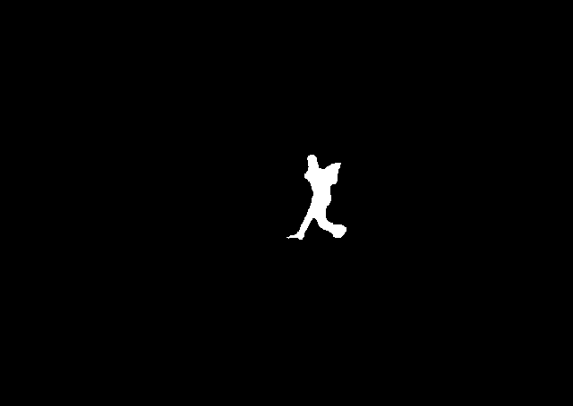
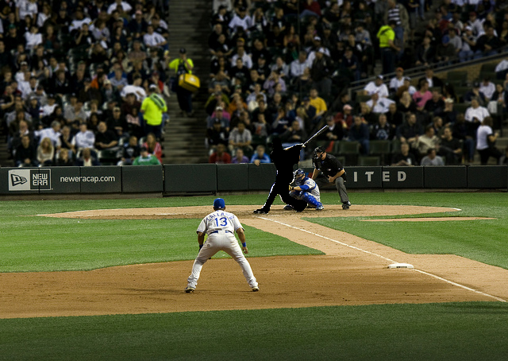
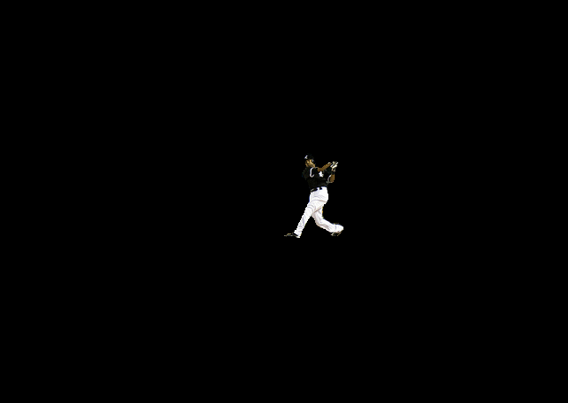
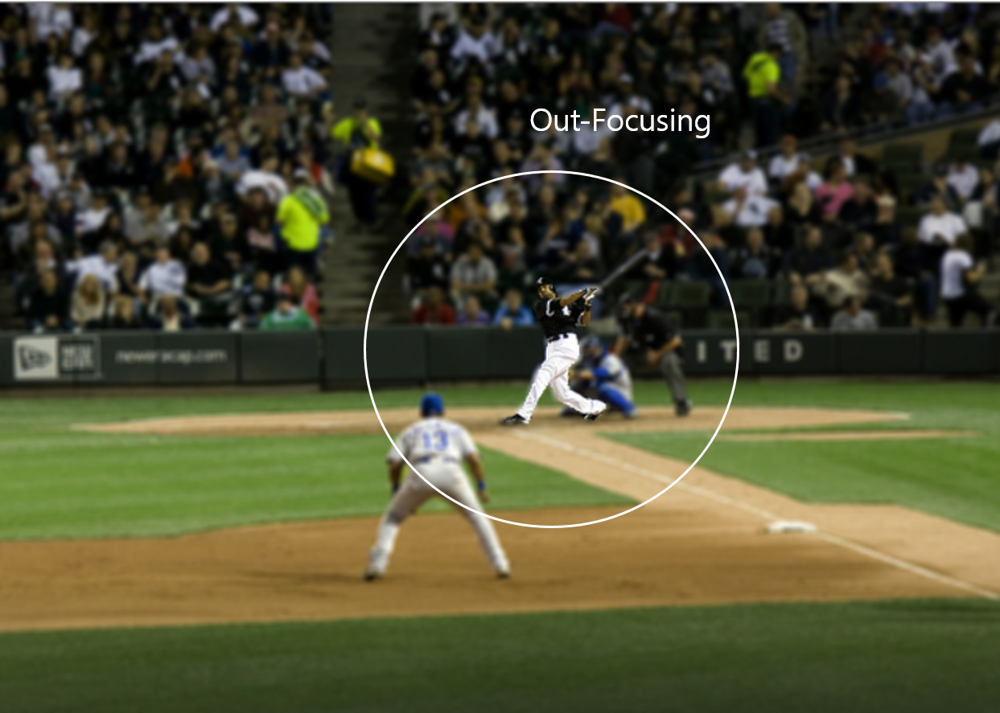

# UnetPointAnnotationSegmentation

## UserInteraction

## Model

## MaskingTask

## refine mask (Threshold: RGB 200)

## removeTarget(Background)

## target(foreground)

## Background blur

# Used Dataset
COCO: Common Objects in Context(COCO) 2017 Train/Val Dataset https://cocodataset.org/#home

============================================================================================

Two Point Interaction Model
Foreground Point(target) ,Background Point 
Point : Set of applying a Gaussian Filter(shape(65*65), segma:7)*k(255*/center_value) about random pixel in mask
